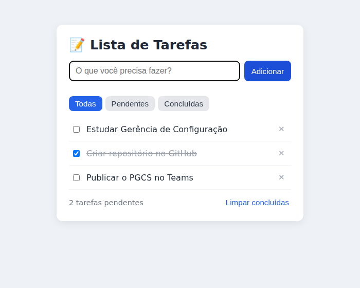

# 📝 Lista de Tarefas

[](https://github.com/Josevoss7/lista-de-tarefas/actions/workflows/cd.yml)

Aplicação web simples para cadastrar, concluir, filtrar e remover tarefas.
As tarefas ficam salvas no próprio navegador (localStorage).

Projeto usado como base do **PGCS — Plano de Gerenciamento de Configuração de Software (enfoque DevOps — CI/CD)**, disponível em [`docs/PGCS_Lista_de_Tarefas.pdf`](docs/PGCS_Lista_de_Tarefas.pdf).

🔗 **Produção:** https://josevoss7.github.io/lista-de-tarefas/



## Tecnologias

| Camada | Ferramenta |
|---|---|
| Aplicação | HTML, CSS e JavaScript puro |
| Testes | Jest (cobertura mínima de 80%) |
| Qualidade | ESLint, CodeQL (SAST), npm audit + Dependabot (SCA) |
| Empacotamento | Docker (nginx:1.27-alpine) |
| CI/CD | GitHub Actions |
| Registro de imagens | GitHub Container Registry (ghcr.io) |
| Produção | GitHub Pages |
| Versionamento | SemVer + Conventional Commits + semantic-release |

## Como executar

```bash
# opção 1 — Node.js
npm install
npm start            # http://localhost:8080

# opção 2 — Docker
docker compose up --build   # http://localhost:8080
```

## Como testar

```bash
npm run lint
npm test
npm run test:coverage
```

## Estrutura do repositório

```
lista-de-tarefas/
├── .github/
│   ├── workflows/        ci.yml, cd.yml, codeql.yml, rollback.yml, pr-titulo.yml
│   ├── ISSUE_TEMPLATE/   modelo de solicitação de mudança
│   ├── dependabot.yml
│   └── pull_request_template.md
├── src/                  código da aplicação (index.html, style.css, app.js, tarefas.js)
├── tests/                testes automatizados (Jest)
├── docs/                 PGCS, ADRs e imagens
├── Dockerfile · nginx.conf · docker-compose.yml
├── eslint.config.js · .releaserc.json · package.json · package-lock.json
└── README.md
```

## Fluxo de trabalho (resumo do PGCS)

1. Abrir uma **issue** descrevendo a mudança (ex.: `#3`).
2. Criar branch de vida curta: `feature/3-editar-tarefa` (ou `fix/...`, `hotfix/...`).
3. Commits no padrão **Conventional Commits**: `feat(tarefas): permite editar título`.
4. Abrir **Pull Request** para `main` → roda o pipeline de **CI**.
5. Com CI verde e revisão feita → **Squash and merge**.
6. O merge dispara o pipeline de **CD**: homologação → aprovação → produção → tag `vX.Y.Z` + release notes.

| Tipo de commit | Efeito na versão |
|---|---|
| `fix:` | PATCH (1.0.**1**) |
| `feat:` | MINOR (1.**1**.0) |
| `feat!:` ou `BREAKING CHANGE:` | MAJOR (**2**.0.0) |
| `docs:`, `chore:`, `test:`, `ci:`, `refactor:` | não gera versão |

## Rollback

Actions → **Rollback** → *Run workflow* → informar a tag estável (ex.: `v1.0.0`).

## Autor

José Voss
